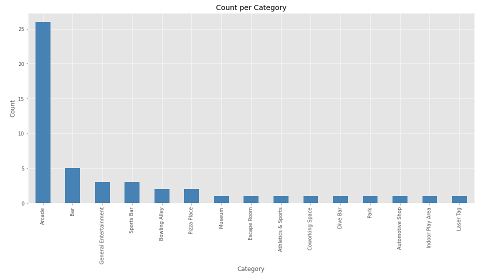

# The Battle of the Neighborhoods - Open an Arcade in Manhattan
----
Amoel Geogy  
July 23, 2021

This is the Capstone project to complete the [IBM Data Science Professional Course](https://www.coursera.org/professional-certificates/ibm-data-science) on Coursera. In this course (which consisted of 9 separate sub-courses) we learned about certain topics like Data Science Methodology, Data Analysis, Data Visualization, connecting to databases and using SQL in Jupyter notebooks and Machine Learning with Python. In this project we will use the skills we acquired to solve a business problem.

----

## 1. Introduction - Business Problem
Our client wants to open an arcade in Manhattan. He has been to almost much all the arcades in Manhattan, but he does not find any of them satisfactory. Being an 80s kid, he lived through the golden age of arcades, and he wants to open one that will satisfy his nostalgia, and show the kids how it really used to be. 

The target audience will mostly be early teenagers to young adults. We would need to find the neighborhoods in Manhattan where the density of this crowd is high. It would make sense to search for areas which have many universities or schools.

## 2. Data
Based on this business problem, we can identify that we need data such as:
* locations of existing arcades
* locations of schools, universities and colleges
* geographical data like the coordinates and areas of each neighborhood in Manhattan

To get the locations of arcades and the academic institutions, we will use the [Foursquare API](https://developer.foursquare.com/docs/). We will use the categoryids provided in the Foursquare [website](https://developer.foursquare.com/docs/build-with-foursquare/categories/) to search for the data of Arcades and College & Universities. We will retrieve the Name, Latitude, Longitude and Category of these locations.

To get the neighborhood boudaries, we will use the geojson file from this [github repository](https://github.com/blackmad/neighborhoods/blob/master/manhattan.geojson). Furthermore, we will use the [geopy.geocoders](https://geopy.readthedocs.io/) module for the coordinates of the neighborhoods. 

We will use the location data to visualize the places on a folium map. We will use the visualizations to analyse the data and find points of interest. Finally we will use a density clustering algorithm (DBSCAN) to find the areas with the most universities and the least arcades. This would be the location where we might propose to the client to open his Arcade.

We plotted the Categories of the results in a bar graph. This allowed us to see that we have unwanted categories in the dataset (like Bar, Museum, etc), and we will filter them out later.

